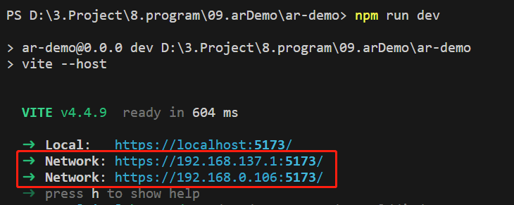

# VR-part

The VR part is implemented using vite + aframe.

# AR-part

The AR part is implemented using vite + ar.js + aframe.

## Project Setup

```sh
npm install
```

### Compile and Hot-Reload for Development

```sh
npm run dev
```

### Open in PC or mobile browser
Ensure that the phone and the computer running the code are on the same network, After running the above command, you can access it on your phone using the following address. The IP and port numbers are based on the actual running results.


### Possible problems and solutions
* The 'npm run dev' command failed to run: Checking the node version requires 14, delete node_modules directory, delete package-lock.json, rerun 'npm install' and 'npm run dev'.
* The project ran successfully, but cannot be opened on the mobile end: Check if the phone and computer are on the same network, check if the generated address is the HTTPS protocol.

# Feature pic required for AR


# Author
Jason Lee - For BuzzAR interviews only
